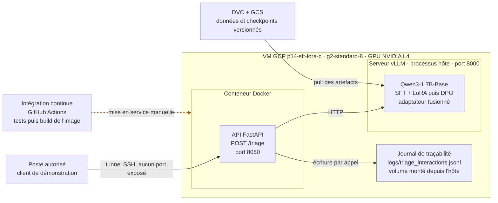

# Medical Triage LLM

POC d'un agent IA de triage médical pour le service des urgences, développé pour le Centre Hospitalier Saint-Aurélien (CHSA).

## Objectif

Fine-tuner un modèle de langage compact (Qwen3-1.7B) pour assister le personnel soignant dans l'évaluation initiale du niveau de priorité des patients (urgence maximale / modérée / différée), à partir de leurs symptômes déclarés.

## Approche

- **SFT (Supervised Fine-Tuning)** avec LoRA sur un dataset médical bilingue FR/EN
- **DPO (Direct Preference Optimization)** pour aligner le modèle sur les pratiques cliniques validées
- **Déploiement** via vLLM, exposé en API FastAPI, conteneurisé avec Docker
- **Intégration continue** GitHub Actions : tests de l'API puis construction de l'image Docker

Statut : Proof of Concept, pas de mise en production. Voir la section [Limites d'usage](#limites-dusage).

## Limites d'usage

Ce prototype n'est pas destiné à un usage clinique, même à titre indicatif. Les limites suivantes sont documentées et mesurées :

- **Fiabilité diagnostique non établie** : des erreurs de diagnostic différentiel ont été observées sur des cas ambigus, y compris sur des urgences à fenêtre thérapeutique critique (infarctus, AVC).
- **Fabrication d'éléments cliniques** : le modèle peut produire des antécédents ou des résultats d'examens absents de l'énoncé, énoncés sans marque les distinguant des données réellement transmises.
- **Sortie non contrainte** : le niveau d'urgence généré peut sortir du vocabulaire fermé attendu, ce qui casserait un parsing automatique en aval.
- **Validation humaine obligatoire** : le système assiste le triage, il ne le décide pas. Toute sortie doit être relue et validée par un soignant.

Analyse complète par mode de défaillance : rapport technique, section 6 (`docs/rapport-technique.md`).

## Structure du projet

```
├── api/             # API FastAPI exposant l'endpoint de triage
│   └── tests/       # tests de fumée exécutés par la CI
├── data/
│   ├── raw/         # données brutes, non versionnées dans git (DVC)
│   ├── processed/   # données nettoyées et anonymisées, non versionnées dans git (DVC)
│   └── eval/        # jeu d'évaluation clinique
├── scripts/         # scripts d'exploration, de préparation des données et d'entraînement
│   └── checks/      # scripts de vérification ponctuelle (audits, diagnostics)
├── models/          # checkpoints et poids, non versionnés dans git (DVC)
├── docs/            # rapport technique, figures, accès démo, sécurité des dépendances
├── logs/            # journal de traçabilité des interactions, non versionné
├── .github/workflows/  # pipeline d'intégration continue
├── Dockerfile       # conteneurisation de l'API de triage
```

## Setup

```bash
uv sync
uv run dvc pull  # récupère les données et checkpoints versionnés
```

`dvc pull` requiert un accès au remote GCS du projet, qui n'est pas ouvert à la consultation externe. Les artefacts nécessaires à l'examen des livrables (jeux de données au format JSONL, adaptateurs LoRA des deux entraînements et leurs configurations) sont fournis directement dans le dépôt de livrables. Le modèle fusionné servi en inférence n'est pas joint en raison de son volume : il se reconstitue à partir de l'adaptateur et du modèle de base publiquement disponible.

## Sources de données

| Source | Licence | Date d'accès | Notes |
|---|---|---|---|
| [MediQA](https://huggingface.co/datasets/ANR-MALADES/MediQAl) | CC-BY-4.0 | 13/07/2026 | Config `mcqu` utilisée : 10 113 train / 2 561 val / 4 343 test. Le volume total du dataset (32 603) inclut d'autres configs non retenues ici. |
| [FrenchMedMCQA](https://huggingface.co/datasets/qanastek/frenchmedmcqa) | Apache 2.0 | 13/07/2026 | 2 171 train / 312 val / 622 test, 3 105 questions au total (examens de pharmacie). |
| [MedQuAD (keivalya)](https://huggingface.co/datasets/keivalya/MedQuad-MedicalQnADataset) | Non spécifiée sur le repo HF source | 13/07/2026 | 16 407 exemples, split unique. Un mirror Kaggle équivalent indique CC0, non formellement confirmé sur cette source. Contenu à faible risque RGPD (Q&A génériques issues de sites publics d'information santé, pas de données patients). |
| [UltraMedical-Preference](https://huggingface.co/datasets/TsinghuaC3I/UltraMedical-Preference) | MIT | 13/07/2026 | 109 353 train / 2 232 val / 777 test. Paires chosen/rejected pour la construction du jeu DPO. |

La licence non déclarée de MedQuAD constitue un point ouvert, à lever avant toute exploitation au-delà du prototype.

## Anonymisation RGPD

Pipeline basé sur Presidio (`AnalyzerEngine`/`AnonymizerEngine`), avec deux modèles de reconnaissance d'entités (`fr_core_news_md` pour le français, `en_core_web_lg` pour l'anglais), `allow_list` dédiée aux éponymes médicaux non ambigus et filtre de contexte (`maladie de`, `syndrome de`) pour limiter les faux positifs sur le vocabulaire clinique. Seuil de confiance fixé à 0,5. Les entités de type `ORGANIZATION` sont exclues du périmètre de détection (faux positifs massifs sur le vocabulaire clinique, sans bénéfice de protection), les `LOCATION` sont conservées au niveau du pays (pertinence en médecine des voyages).

Deux points d'entrée :
- `scripts/anonymize_dataset.py` : traite le dataset SFT seul.
- `scripts/anonymize_datasets.py` : orchestre l'anonymisation SFT **et** DPO.

Deux limites connues, documentées et assumées pour ce POC :

- Résidu de tags `<LOCATION>` sur des termes médicaux figés à consonance géographique (ex. noms de syndromes), quantifié à environ 0,9 % sur le jeu DPO (`scripts/checks/check_dpo_anonymization.py`). Décision assumée de ne pas itérer davantage sur Presidio.
- Des tags d'anonymisation non résolus (`<LOCATION>`, `[PATIENT]`) apparaissent parfois dans les réponses générées, un sous-ensemble des paires SFT contenant des placeholders Presidio non nettoyés avant l'entraînement. Ce défaut porte sur la robustesse du pipeline de préparation des données, non sur la conformité du masquage lui-même : ce sont les marqueurs de remplacement qui fuitent, pas les données qu'ils ont substituées. Analysé dans le rapport technique, section 6.4.

## Modèle

- **SFT + LoRA** : entraîné sur ~5 000 paires instruction-réponse, format structuré (Niveau d'urgence / Service / Explication). Config LoRA : `r=16, lora_alpha=32, target_modules=[q_proj,k_proj,v_proj,o_proj]`, `gradient_checkpointing=True`, `max_length=512`. Durée du run : ~26 min sur GPU L4. Checkpoint versionné DVC (`models/sft-lora-qwen3-1.7b`).
- **DPO** : entraîné à partir du modèle SFT, sur les 5 000 paires préférentielles issues d'UltraMedical-Preference (`label_type == "hard"`). Config : `beta=0.1, learning_rate=5e-6, num_train_epochs=1`, adaptateur LoRA désactivable utilisé comme politique de référence (pas de copie séparée du modèle en mémoire). Durée du run : ~43 min sur GPU L4. Checkpoint versionné DVC (`models/dpo-lora-qwen3-1.7b`).

Métriques finales du run DPO (dernier step logué, tracking Weights & Biases) :
- `rewards/accuracies` : 0,75
- `rewards/margins` : 0,84
- `rewards/chosen` : +0,55, `rewards/rejected` : -0,29
- `train_loss` : 0,55

Ces métriques mesurent un classement relatif entre réponses préférées et rejetées. Elles ne mesurent pas la fidélité d'une réponse aux éléments fournis en entrée, et n'ont détecté aucune des défaillances cliniques décrites ci-dessous.

## Évaluation clinique (base vs SFT vs SFT+DPO)

Comparaison qualitative menée sur 5 vignettes cliniques (`scripts/compare_base_vs_sft.py`), dont deux ciblées sur des confusions diagnostiques à risque (AVC, appendicite), complétée par 2 cas observés lors des tests sur l'endpoint et sur le conteneur.

Constat principal : le DPO améliore la pertinence générale de forme (structure, niveau d'urgence, service), mais **ne corrige pas de façon fiable les erreurs de diagnostic différentiel sur des cas ambigus**, et introduit un risque spécifique de **fabrication d'éléments cliniques absents de l'énoncé** (antécédents, résultats d'examens inventés). Une dérive occasionnelle hors du vocabulaire fermé attendu pour le niveau d'urgence a également été observée.

Détail des cas observés et analyse par mode de défaillance : rapport technique, section 6 (`docs/rapport-technique.md`).

Ce constat n'appelle pas de nouvel entraînement dans le cadre du POC. Il alimente la section limites et la roadmap du rapport technique (garde-fous à prévoir en production : vérification factuelle, citation des éléments de l'énoncé, refus de générer un antécédent ou un résultat d'examen non fourni, décodage contraint sur le vocabulaire fermé).

## Déploiement



- **Serveur d'inférence** : vLLM, servant le modèle SFT+DPO avec l'adaptateur LoRA fusionné (`merge_and_unload`) au modèle de base, sur le port 8000.
- **API** : FastAPI (`api/main.py`), endpoint `POST /triage` exposé sur le port 8080, reconstruit le format de prompt d'entraînement à partir des symptômes fournis, journalise chaque interaction (`logs/triage_interactions.jsonl`) pour traçabilité et audit médical. La validation Pydantic porte sur l'entrée : la sortie du modèle est restituée telle quelle, sans structuration ni contrainte.
- **Conteneurisation** : image Docker dédiée à l'API (dépendances minimales, pas d'entraînement embarqué), communique avec le serveur vLLM via `--network host`. Le répertoire `logs/` doit être monté en volume depuis l'hôte, sans quoi les interactions sont écrites dans le filesystem éphémère du conteneur et perdues à chaque redémarrage.
- **Accès** : aucune règle de pare-feu ouverte, aucun port exposé publiquement. Accès par tunnel SSH uniquement, procédure dans `docs/acces-demo.md`.
- **Intégration continue** : pipeline GitHub Actions (`.github/workflows/ci.yml`), déclenché à chaque commit et à chaque pull request vers `main`. Enchaîne les tests de l'API puis, conditionnée à leur réussite, la construction de l'image Docker. La mise en service sur la VM reste manuelle : l'image n'est ni publiée sur un registre ni déployée automatiquement.

## Infrastructure

- Entraînement et inférence sur VM GCP (`europe-west4-c`, `g2-standard-8`, GPU NVIDIA L4). Le run DPO complet a été exécuté en zone `europe-west4-c` suite à une indisponibilité temporaire (stockout) de la zone `europe-west4-a` initialement utilisée pour le SFT.
- Versionnement des données et modèles via DVC, remote GCS.
- Tracking des runs via Weights & Biases (projet `p14-triage-medical`).
- Dépendances de sécurité : `cryptography` et `gitpython` mis à jour suite à alertes Dependabot (high), 10 CVE `vllm` corrigées par montée de version (restriction de la résolution `uv` à la plateforme Linux). Trois vulnérabilités résiduelles (`setuptools`, `diskcache`, `torch`), sans correctif compatible avec les contraintes de version de vLLM : analyse des conditions d'exploitation et décisions dans `docs/securite-dependances.md`.

## Livrables

| Livrable | Emplacement |
|---|---|
| Dataset médical bilingue anonymisé et versionné | `data/processed/` (DVC), JSONL fournis dans le dépôt de livrables |
| Modèle SFT + LoRA aligné DPO | `models/` (DVC), adaptateurs fournis dans le dépôt de livrables |
| Endpoint de démonstration | `api/`, procédure d'accès dans `docs/acces-demo.md` |
| Pipeline d'intégration continue | `.github/workflows/ci.yml` |
| Rapport technique | `docs/rapport-technique.md` |

## Statut du projet

Dataset bilingue anonymisé, modèle SFT+LoRA, alignement DPO, évaluation clinique comparative, endpoint de démonstration (vLLM + FastAPI + Docker), intégration continue et rapport technique : finalisés.